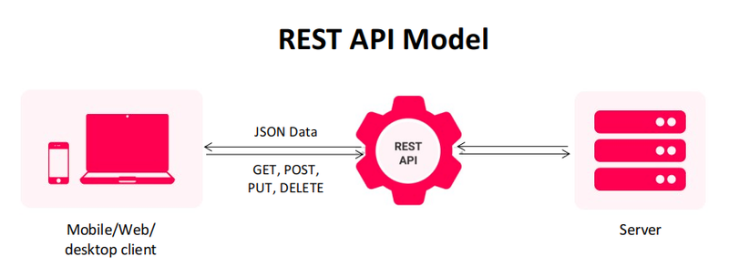

<h1 align="center">
    Restful API
</h1>

<br />

Let's talk about what is a **Restful API** and how we can implement an standard one.

<br />

## What is REST API?

An API, or application programming interface, is a set of rules that define
how applications or devices can connect to and communicate with each other.
A **Restful API** is an API that conforms to the design principles of the REST,
or representational state transfer architectural style.

<br />

<p align="center">
    
</p>

<br />

## Is REST API always HTTP?

REST APIs add no new capability to HTTP APIs.
But it is an architectural style that was created in tandem with HTTP and
most typically employs HTTP as its application layer protocol.
However, REST isn't always linked to HTTP.
You can use other transfer protocols, such as FTP, SMTP, etc.

<br />

## Is REST API always JSON?

The REST architecture allows API providers to deliver
data in multiple formats such as plain text,
HTML, XML, YAML, and JSON, which is one of its most loved features.

<br />

## Principles

The six guiding principles or constraints of the Restful architecture are:

- Uniform Interface
- Client-Server
- Stateless
- Cacheable
- Layered System
- Code on Demand (Optional)

<br />

## Resource

REST stands for Representational State Transfer.
This means that when a client requests a resource using
a REST API, the server transfers back the current state
of the resource in a standardized representation.

The key abstraction of information in REST is a resource.
Any information that we can name can be a resource.
For example, a REST resource can be a document or image, a temporal service, a
collection of other resources, or a non-virtual object (e.g., a person).

<br />

## Example

Building a Restful API with python fastapi library. Enter into fastapi directory and start api server:

```shell
uvicorn main:app --reload
```

### Make requests using curl

Check api version:

```shell
curl -w '\n' localhost:8000/api
```

Insert a device:

```shell
curl -w '\n' -X POST -H "Content-Type: application/json" --data '{"version": 0.5, "platform": "IOS"}' localhost:8000/api/device
```

Get the list of devices:

```shell
curl -w '\n' localhost:8000/api/device
```

Update a device:

```shell
curl -w '\n' -X PUT -H "Content-Type: application/json" --data '{"version": 0.1, "platform": "IOS"}' localhost:8000/api/device/10002
```

Delete a device:

```shell
curl -w '\n' -X DELETE localhost:8000/api/device/10002
```
